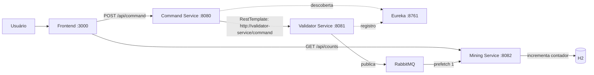

# Space Mining

Aplicação com frontend em HTML, CSS e JavaScript e quatro projetos Java: três
serviços e o servidor de descoberta Eureka. Os projetos Java têm builds Gradle
independentes; o build da raiz agrega suas tarefas.

| Projeto | Porta | Responsabilidade |
| --- | --- | --- |
| `command-service` | 8080 | Recebe `POST /command` e encaminha via RestTemplate |
| `validator-service` | 8081 | Valida, aplica retry e publica no RabbitMQ |
| `mining-service` | 8082 | Consome, registra execução e persiste contagens no H2 |
| `eureka-server` | 8761 | Registro e descoberta do Command e do Validator |
| `frontend` | 3000 | Interface para enviar comandos e consultar contagens |



## Executar

Requisitos: Java 17 e Docker com Compose. Na raiz:

```sh
./gradlew bootJar
docker compose up -d --build
```

O Compose inicia o frontend, os quatro projetos Java e o RabbitMQ. Acesse o
frontend em **http://localhost:3000**. Aguarde os serviços iniciarem e
o registro aparecer em http://localhost:8761. A descoberta pode levar cerca de
um minuto; nesse intervalo, o envio pode retornar 503. O painel do RabbitMQ
fica em http://localhost:15672 (`guest`/`guest`).

Para conferir as APIs diretamente:

```sh
curl -i -X POST http://localhost:8080/command \
  -H 'Content-Type: application/json' -d '{"command":"LEFT"}'
curl http://localhost:8082/commands/counts
docker compose logs mining-service
```

O POST retorna 202 após enviar ao RabbitMQ; o processamento é assíncrono. A consulta
retorna um objeto como `{"BACK":0,"CLOSE":0,"FRONT":0,"LEFT":1,"OPEN":0,"RIGHT":0}`.
O banco é exclusivo do MiningService, persistido no volume `mining-data`.

Para encerrar sem apagar os dados:

```sh
docker compose down
```

## Comportamento

- Comandos aceitos: RIGHT, LEFT, FRONT, BACK, OPEN e CLOSE, exatamente em maiúsculas.
  Comando inválido retorna 400 sem retry.
- O frontend atualiza as contagens a cada três segundos e mostra os últimos 20
  envios da sessão. O histórico é apagado ao recarregar a página. “Na fila”
  indica aceite do envio, não a execução individual do comando.
- Cada tentativa de validação tem 50% de chance de falha simulada. São até cinco
  tentativas, com intervalos de 500, 1000, 2000 e 4000 ms; esgotamento retorna 503.
- O Command usa o Eureka para localizar o Validator.
- Backpressure: prefetch 1, concorrência 1 e fila com um único consumidor ativo,
  inclusive se uma segunda instância do Mining se conectar. O contador é
  atualizado em uma transação e a mensagem é reconhecida após o commit.
- Falhas no consumidor têm até cinco tentativas com espera exponencial. Após o
  esgotamento, a mensagem vai para `robot.commands.v2.failed` para inspeção.
- A fila durável passou a se chamar `robot.commands.v2` porque seus argumentos
  mudaram. A fila antiga `robot.commands`, se existir, não é removida nem migrada;
  novas aplicações usam apenas a v2.

RabbitMQ e banco não compartilham transação: uma reentrega após falha entre commit
e confirmação pode contar novamente o comando. A simulação por log não representa
controle de um robô físico nem oferece garantia de execução única.
