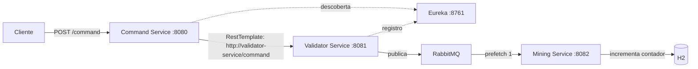

# Space Mining

Implementação do [enunciado](Exercício%2006%20-%20Space%20Mining.pdf), com três
projetos independentes para os serviços e um projeto auxiliar de infraestrutura
para o Eureka mostrado no diagrama. Cada pasta possui seu próprio `build.gradle`,
`settings.gradle`, Gradle Wrapper, código, testes, configuração e JAR executável.
Pode ser aberta separadamente na IDE; não há dependência de código entre projetos.
A raiz apenas agrega os builds para facilitar os testes e o empacotamento.

| Projeto | Porta | Responsabilidade |
| --- | --- | --- |
| `command-service` | 8080 | Recebe `POST /command` e encaminha via RestTemplate |
| `validator-service` | 8081 | Valida, aplica retry e publica no RabbitMQ |
| `mining-service` | 8082 | Consome, registra execução e persiste contagens no H2 |
| `eureka-server` | 8761 | Registro e descoberta do Command e do Validator |



## Executar com Docker

Requisitos: Java 17 e Docker com Compose. Na raiz:

```sh
./gradlew bootJar
docker compose up -d --build
```

O frontend fica em **http://localhost:3000**, com seleção de comandos, histórico
de envios e contagens atualizadas automaticamente. O projeto está em `frontend/`
e também pode ser executado localmente com Node.js 22+: `cd frontend && npm start`.
Veja as [instruções do frontend](frontend/README.md).

Aguarde as aplicações iniciarem e o registro aparecer em http://localhost:8761.
A descoberta pode levar cerca de um minuto; durante esse intervalo a chamada pode
retornar 503. O painel do RabbitMQ fica em http://localhost:15672 (`guest`/`guest`).

```sh
curl -i -X POST http://localhost:8080/command \
  -H 'Content-Type: application/json' -d '{"command":"LEFT"}'
curl http://localhost:8082/commands/counts
docker compose logs mining-service
```

O POST retorna 202 após enviar ao RabbitMQ; o processamento é assíncrono. A consulta
retorna um objeto como `{"BACK":0,"CLOSE":0,"FRONT":0,"LEFT":1,"OPEN":0,"RIGHT":0}`.
O banco é exclusivo do MiningService, persistido no volume `mining-data`.

Para encerrar sem apagar os dados:

```sh
docker compose down
```

## Executar cada projeto localmente

Suba somente o RabbitMQ com `docker compose up -d rabbitmq`. Em terminais separados,
execute um comando por projeto, a partir da raiz:

```sh
./gradlew -p eureka-server bootRun
./gradlew -p validator-service bootRun
./gradlew -p mining-service bootRun
./gradlew -p command-service bootRun
```

Também é possível entrar em qualquer pasta e executar `./gradlew bootRun` ou
`./gradlew test`. O H2 local fica em `mining-service/data/space-mining`.
`PORT` altera a porta de cada aplicação; `EUREKA_URL` define a URL do registro.
Validator e Mining aceitam `RABBITMQ_HOST`, `RABBITMQ_PORT`, `RABBITMQ_USERNAME` e
`RABBITMQ_PASSWORD`. Mining também aceita `DATABASE_URL` para a URL JDBC do H2.

## Comportamento

- Comandos aceitos: RIGHT, LEFT, FRONT, BACK, OPEN e CLOSE, exatamente em maiúsculas.
  Comando inválido retorna 400 sem retry.
- Cada tentativa de validação tem 50% de chance de falha simulada. São até cinco
  tentativas, com intervalos de 500, 1000, 2000 e 4000 ms; esgotamento retorna 503.
- O RestTemplate usa `@LoadBalanced` para resolver `validator-service` no Eureka.
  A compatibilidade entre Boot 4.1.1 e Cloud 2025.1.3 segue a
  [matriz oficial do Spring Cloud](https://spring.io/projects/spring-cloud/#overview).
- Backpressure: prefetch 1, concorrência 1 e fila com um único consumidor ativo,
  inclusive se uma segunda instância do Mining se conectar. Assim como no
  TicketService de `ticket-x`, o MiningService usa entidade e repositório JPA,
  bloqueia o contador com `PESSIMISTIC_WRITE` e o atualiza dentro de uma transação.
  A mensagem é reconhecida após o commit.
- Falhas no consumidor têm até cinco tentativas com espera exponencial. Após o
  esgotamento, a mensagem vai para `robot.commands.v2.failed` para inspeção.
- A fila durável passou a se chamar `robot.commands.v2` porque seus argumentos
  mudaram. A fila antiga `robot.commands`, se existir, não é removida nem migrada;
  novas aplicações usam apenas a v2.

RabbitMQ e banco não compartilham transação: uma reentrega após falha entre commit
e confirmação pode contar novamente o comando. A simulação por log não representa
controle de um robô físico nem oferece garantia de execução única.
